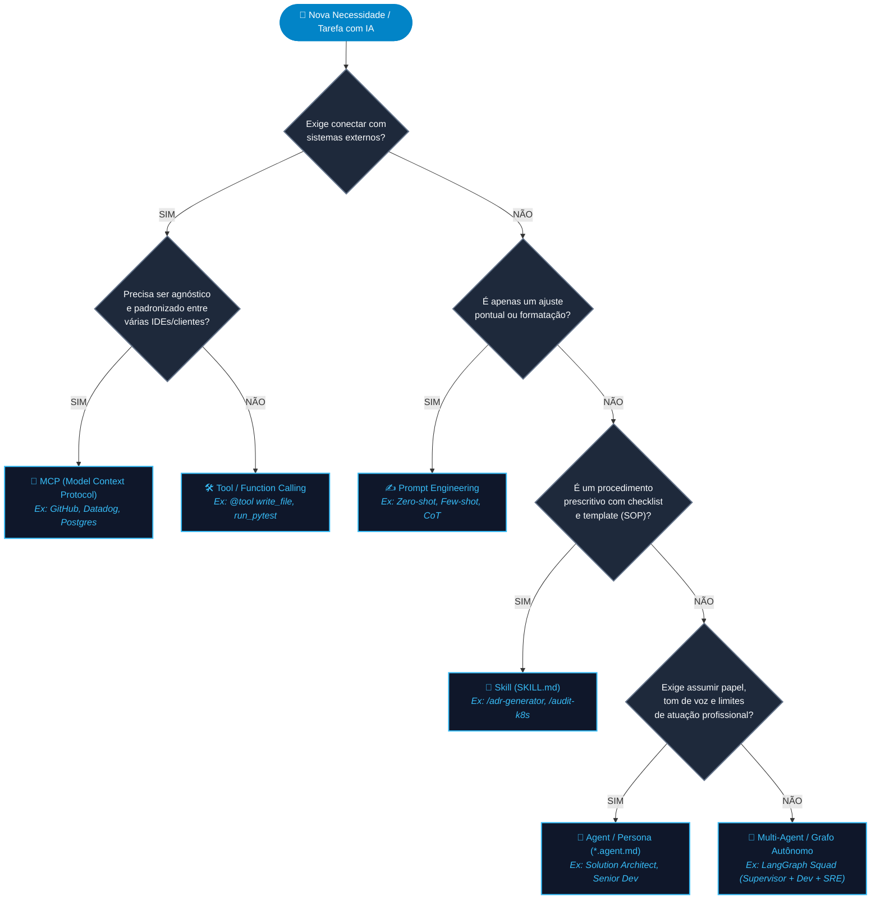

# Everything about artificial intelligence

## Fluxograma


## Some Concepts

### O que é um modelo de IA?
Um modelo de IA é um "cérebro treinado em formato de arquivo" que aprendeu a reconhecer padrões e agora consegue responder perguntas, reconhecer imagens ou tomar decisões sem precisar de uma regra fixa programada para cada caso.

### O que é IA Generativa?
A IA Generativa é a capacidade da inteligência artificial de criar coisas novas (gerar texto, imagens, músicas, vídeos ou códigos) a partir de um pedido, em vez de apenas classificar ou escolher opções prontas.

### O que é IA Agêntica?
A IA Agêntica é quando a inteligência artificial deixa de ser apenas uma "conversa passiva" (que só responde e espera) e passa a ter iniciativa, capacidade de tomar decisões e usar ferramentas no mundo real para cumprir um objetivo completo.

### O que é LLM (Large Language Model / Grande Modelo de Linguagem)?
Um LLM é o "motor" ou a base de conhecimento. Trata-se de um supercomputador treinado com quase todo o texto público da internet (livros, artigos, conversas, códigos). Ele aprendeu os padrões da linguagem humana tão bem que consegue prever e combinar palavras de forma natural e coerente.

### O que é Loop Engineer?
Loop Engineer é quem constrói o sistema que permite à Inteligência Artificial executar uma tarefa, testar o próprio resultado, corrigir os próprios erros e tentar de novo em repetição (em loop), até entregar o trabalho perfeito sem precisar de um humano dizendo o que fazer a cada minuto.

### O que é Harness Engineering?
Harness Engineering é a disciplina de construir o ambiente de segurança, regras, testes e ferramentas ao redor da Inteligência Artificial, garantindo que ela trabalhe sozinha de forma confiável, corrija seus próprios erros e entregue o resultado perfeito sem quebrar nada.

## Criando virtual environment
```
py -3.12 -m venv .venv
python -m venv .venv
source .venv/Scripts/activate
pip install -r requirements.txt
```

## Universal Directory Structure (.ai/ or .agent/)
```
meu-projeto/
├── .agent/                      # Pasta agnóstica centralizada
│   ├── rules/                   # Regras globais de engenharia
│   │   ├── code-standards.md
│   │   └── security.md
│   ├── personas/                # Definição dos agentes
│   │   ├── architect.md
│   │   ├── developer.md
│   │   └── product-manager.md
│   └── skills/                  # Procedimentos e runbooks
│       ├── run-tests/
│       │   └── SKILL.md
│       └── pr-review/
│           └── SKILL.md
│
├── .mcp/
│   └── config.json              # Configuração agnóstica de servidores MCP
│
├── AGENTS.md                    # Ponto de entrada universal para qualquer agente
│
# Bridges / Links Simbólicos para ferramentas específicas:
├── .cursorrules                 # -> Aponta para .agent/rules/code-standards.md
├── .github/
│   ├── copilot-instructions.md  # -> Aponta para .agent/rules/code-standards.md
│   └── skills/                  # -> Link ou cópia de .agent/skills/
└── CLAUDE.md                    # -> Aponta para AGENTS.md
```


|Skill	                                |Escopo Principal	    |Impacto Organizacional|
|-------------|-------------|-------------|
|adr-generator	                        |Arquitetura de Software|Governança técnica e histórico de decisões transparente.|
|k8s-platform-policy-guard	            |Platform Engineering	|Redução drástica de falhas de deploy e vulnerabilidades em cluster.|
|slo-datadog-monitor-designer	        |SRE & Operações	    |Padronização de observabilidade sem esforço manual das squads.|
|iac-security-and-finops-auditor	    |Cloud / DevOps	        |Segurança em camadas e controle de custos de infraestrutura.|
|api-contract-breaking-change-detector	|Integrações / SDD	    |Eliminação de indisponibilidades por incompatibilidade de contratos.|
|incident-postmortem-copilot	        |Cultura de Engenharia	|Resiliência sistêmica contínua e aprendizado pós-falha.|